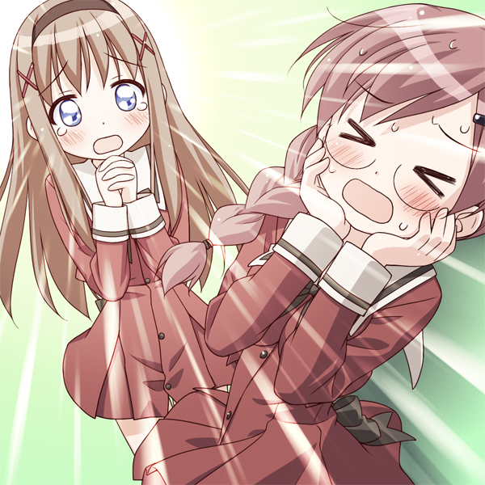
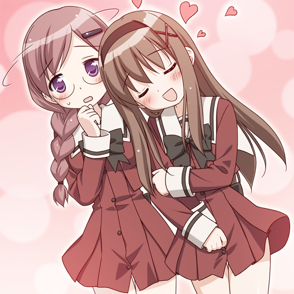
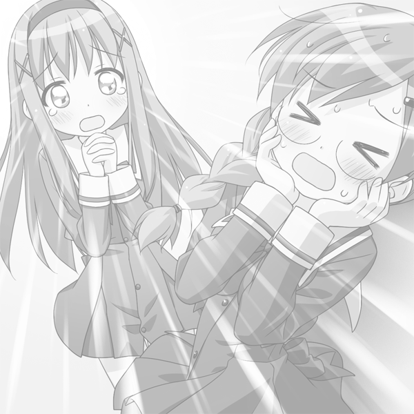

# Shadow-Tank
A simple python tool to make shadow tank images. Currently only support B&W image.

一款基于Python的制作幻影坦克图的简易工具。目前只支持输出黑白图像。

### What is Shadow Tank? 什么是幻影坦克？

A Shadow Tank image is an image file with a smartly arranged alpha channel, so that it shows different pictures with different backgrounds. Normally a shadow tank image contains two pictures corresponding to black (or dark grey) background and white (or light grey) background.

一种 ~~开车专用图~~ 神奇的图片，在不同的背景下会显示出不同的图片。由于百度贴吧和QQ等平台的图片查看机制是预览时白底、点开黑底，完美地为幻影坦克提供了工作环境，因此这类图片一度流传甚广。

### Working Principle 工作机制

The key of a Shadow Tank image is its alpha channel. It enables a pixel to show different colour with different background. According to alpha compositing, a pixel with  and alpha  as foreground and a pixel with solid  as background will result in , where

Therefore, for the same pixel , different background  will give different result .

### How to generate a Shadow Tank 如何制作幻影坦克图

Knowing the working principle, all we need to do is reverse-engineering. What we want is such a pixel  that displays  with white background  and  with black background . So we can get the following equations:

It's clear that we can't always get a solution from the above equations. But with a compromisation, things get easier: let's convert the two pictures into grey-scale ones, i.e. . Then the equations become

Then we can always get a solution

But we need to note that there is a limitation: c_2" title="c_1>c_2" /> must holds, otherwise we will get an  out of . It's easy to understand, since a pixel always looks brighter with a white background than with a black background. So we need to brighten the white-based image and darken the black-based image in advance.

To conclude, the process of merging two images into a Shadow Tank image is the following:

1. Convert the two images to grey-scale ones and scale them to be of the same size.
2. Check if the value of pixels in white-based image are all bigger than those in the same positions in the black-based image. If not, brighten the white-based image and darken the black-based image and check again.
3. For every pixel, calculate the new alpha and color with the equation .
4. Export the generated image.

### Usage 使用方法

`python ShadowTank.py <inputfile1> <inputfile2> <outputfile>`

### Dependencies 依赖项

numpy (for easy operation of array)

### Examples 演示结果

##### Original images 原图

##### Result 结果

White background 白底 

Black background 黑底 